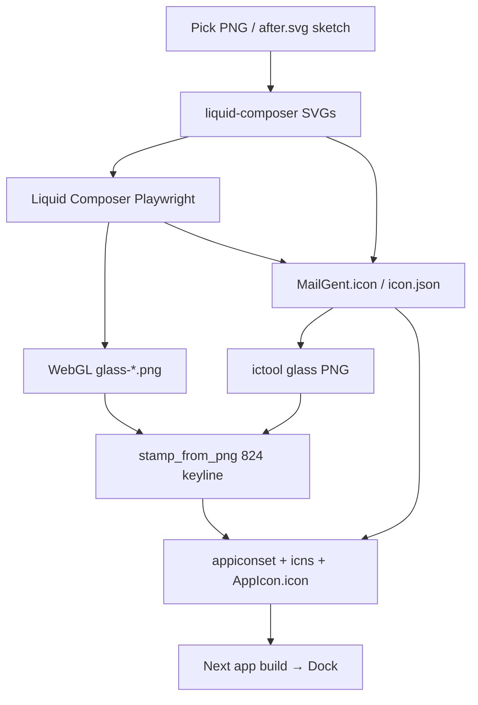
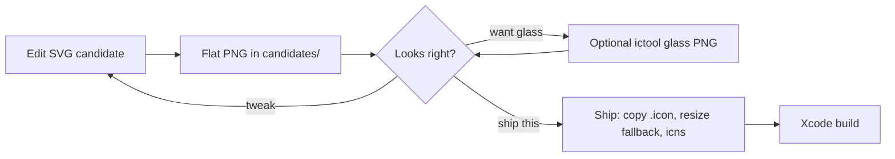

# MailGent app icon — original pipeline (archive)

**Going forward:** `docs/agents/app-icon.md` (skill `.cursor/skills/app-icon`). This file is the 2026-08-23 archaeology of how the mark was built and why the double-keyline stamp failed.

Status: archive. Preferred candidate is **not** compiled into the app yet (`candidates/2026-08-23-after-tweaks`).

This note captures the **original / current pipeline** as it actually ran in the repo, why the latest `AppIcon.appiconset` stamp is worse than `.scratch/_icon-preview/after.svg`, and how the candidate-first loop was derived.

---

## What the running app actually uses

Two icon runtimes, copied at **build** time:

| Runtime | Path | When it shows |
|---|---|---|
| Tahoe Liquid Glass | `MailGent/Resources/AppIcon.icon` | macOS that understands `.icon` |
| Fallback PNG / icns | `MailGent/Assets.xcassets/AppIcon.appiconset` + `MailGent/Resources/AppIcon.icns` | Dock / Finder on older macOS, asset catalog |

Xcode setting: `ASSETCATALOG_COMPILER_APPICON_NAME = AppIcon`. A Run Script phase (`Ensure AppIcon assets` in `MailGent.xcodeproj/project.pbxproj`) copies both `AppIcon.icns` and `AppIcon.icon` into the built app’s `Contents/Resources`.

**Compile is a one-way door.** Once those files are overwritten, the next build is the Dock. There is no candidate gate today.

---

## Original workflow (as built)

Three eras stacked on top of each other. All three still exist.

### Era A — drawn marks (`Scripts/AppIcon/`)

Throwaway logo exploration. Four flat AppKit designs: companion, pair, mono, seal.

```text
Scripts/AppIcon/run.sh N
  → generate_app_icon.swift   draws glyph into Apple 824/1024 keyline
  → AppIcon.appiconset
  → iconutil                  → MailGent/Resources/AppIcon.icns
  → test_app_icon.swift       asserts keyline ratio 0.8047 ± 0.015
```

Gallery: `Design/IconPack/index.html`. Spec literals: `Scripts/AppIcon/AppleIconSpec.swift` (`1024` master, `824` keyline, continuous-corner `0.2237`).

This path draws a **glyph on a plate inside the keyline**. It never double-insets.

### Era B — traced charge pack (`Design/IconPack/`)

The shipped mark is the cream charge traced from the pick PNG, not the Era A envelopes.

```text
pick PNG (shield-02-charge)
  → .scratch/_icon-trace/TraceShield.swift     luma flood → layer SVGs
  → Design/IconPack/liquid-composer/*.svg      one path per glass layer
  → Liquid Composer (Playwright, :11009)
        compose() + exportPack()
  → .scratch/liquid-composer/scripts/export-mailgent.mjs
        unzip pack
        copy MailGent.icon → Design/IconPack/ + Resources/AppIcon.icon
        rewrite icon.json (Apple fill + splitIconGroups)
        copy WebGL appearances → glass-*.png
        stamp_from_png.swift glass-default.png → appiconset
        packIcns → AppIcon.icns
        zip → Design/IconPack/MailGent-iconpack.zip
```

Layer contract: `Design/IconPack/liquid-composer/README.md`.

- Same `viewBox="156 162 712 712"` on every SVG so they register.
- LC default layer scale **80%** ≈ Apple 824 keyline.
- Icon Composer `scale = layout.scale / 65`. `80 / 65 ≈ 1.2308` — that number in `icon.json` is LC’s unit conversion, not a zoom choice. Source: `.scratch/liquid-composer/src/engine/iconPack.ts` (`APPLE_SCALE_UNIT = 65`).

Sparkles in the **source trace** are **holes** in the field (`02-field.svg`, evenodd). `02-field-solid.svg` is the same silhouette with holes filled, for Liquid Glass (holes become separate layers).

### Era C — glass / envelope iteration (this thread)

Bypass LC for speed. Edit SVGs + `icon.json` by hand, preview with Apple `ictool` 1.2, then still **stamp** the ictool PNG through Era A’s `stamp_from_png.swift`.

```text
liquid-composer SVGs + icon.json
  → ictool --export-image --platform macOS --rendition Default --width 1024
  → Design/IconPack/glass-*.png
  → stamp_from_png.swift          ← this is the crop bug
  → AppIcon.appiconset + AppIcon.icns
```

`ictool` lives at `Xcode.app/Contents/Applications/Icon Composer.app/Contents/Executables/ictool`. Renditions: `Default`, `Dark`, `TintedLight`, `TintedDark`, `ClearLight`, `ClearDark`.

MCP `export_preview` is **not** a source of truth: it rewrote layer `scale` `1.2308 → 0.67694` and crushed the glyph. Use `ictool` directly.

`ictool` 1.2 drops cubic Bézier `C` commands (sparkles and discs vanish). Flatten to `L` segments if a shape must survive glass render.

---

## Pipeline (current)



There is **no review stop** between `ictool` / `after.svg` and `app`.

---

## File map

| Role | Path |
|---|---|
| Layer source | `Design/IconPack/liquid-composer/*.svg` |
| Gallery / appearances | `Design/IconPack/glass.html`, `glass-*.png` |
| Tahoe bundle | `Design/IconPack/MailGent.icon` (canonical) and `MailGent/Resources/AppIcon.icon` (must stay copies) |
| Fallback | `MailGent/Assets.xcassets/AppIcon.appiconset/` |
| icns | `MailGent/Resources/AppIcon.icns` |
| Export driver | `.scratch/liquid-composer/scripts/export-mailgent.mjs` |
| Keyline stamp | `Scripts/AppIcon/stamp_from_png.swift` |
| Flat sketches | `.scratch/_icon-preview/before.svg`, `after.svg` |
| Scratch probes | `.scratch/_icon-preview/`, `.scratch/_icon-trace/` |

---

## Why the latest appiconset lost to `after.svg`

Evidence: `MailGent/Assets.xcassets/AppIcon.appiconset/icon_256x256.png` vs `.scratch/_icon-preview/after.svg` / `before.svg`.

### 1. Cropped twice (the main framing bug)

Two different meanings of “824 keyline” got applied in series.

1. **Glyph keyline** — map the 712-unit artboard onto 824 of a 1024 canvas. `after.svg` does this in one transform: `scale(824/712) ≈ 1.157`, plate is a full 1024 squircle (`rx=229` = `0.2237 × 1024`). The mark fills the icon the way a Dock tile should.
2. **Stamp keyline** — `stamp_from_png.swift` takes a **finished 1024 icon** (ictool already drew plate + glyph + glass) and draws that whole image into an 824 squircle on a new 1024 canvas.

Result: `824/1024 × 824/1024 ≈ 66%` of the frame. Black/transparent gutter around a second, smaller rounded plate. That is the “cropped too much” on `icon_256x256.png`.

`stamp_from_png` is correct for Era A (glyph-only master). It is wrong for an ictool / LC **full icon** master.

### 2. Sparkle background is a different design

| | `after.svg` / `before.svg` | Latest `.icon` + stamp |
|---|---|---|
| Sparkles | Holes. Cream field, plate colour punched through (`#4B617F` stars, same idea as `02-field.svg` evenodd) | Separate gold discs (`sparkle-back-*.svg`) + white stars, own glass group |
| Read | Stars are windows in the shield | Tan coins glued on |

`ictool` also fights the disc approach (Bézier drop, fill-specializations, group paint order). The sketch the user prefers never had discs.

### 3. Envelope stack drifted past the sketch

`after.svg` layers, back → front:

1. Plate gradient
2. **Overcast** — larger rounded rect, `#3D4C5F` @ 0.28 — the extra shadow
3. **Body rect** — `#3D4C5F` @ 0.42 — the “main rectangle”
4. **Flap triangle** — `M224.1,372 L512,598 L799.9,372 Z` @ 0.5 — the “envelope top triangle”
5. Cream bowl + cream field
6. Sparkle holes

Latest `.icon` kept a **solid slate envelope body** (no glass) so the V is a hard band, plus gold discs. That is a different mark than `after.svg`.

`before.svg` is the charge only: plate + cream + smaller hole sparkles. No shadow, no envelope.

---

## Preferred candidate (not compiled)

User direction, 2026-08-23:

> like `after.svg` with: envelope top triangle removed; extra shadow stays; main rectangle removed.

That is:

- Keep plate, cream charge, **2× hole sparkles**, **overcast shadow**
- Drop flap triangle
- Drop envelope body rect
- Do **not** use gold discs
- Do **not** run `stamp_from_png` on a full ictool PNG

Preview (review only, not in the app):

- `.scratch/app-icon/candidates/2026-08-23-after-tweaks.svg`
- `.scratch/app-icon/candidates/2026-08-23-after-tweaks.png`

Approve this (or a further tweak) **before** any write to `AppIcon.appiconset` / `AppIcon.icon` / `AppIcon.icns`.

---

## Optimise

### Speed

The slow path is Playwright + Liquid Composer + unzip + rewrite + stamp + rebuild.

Fast path for iteration:

1. Edit layer SVGs (or a 1024 sketch like `after.svg`)
2. `qlmanage` / rsvg for a **flat** 512 PNG in `.scratch/app-icon/candidates/`
3. Only if glass is in question: `ictool --export-image` of a scratch `.icon` into the same candidates folder
4. Stop. Show the candidate. Do not stamp.

LC export stays the **ship** tool, not the **sketch** tool. Skip MCP `export_preview`.

### Quality

1. **One keyline.** Either:
   - Sketch/ictool PNG is a **full 1024 icon** (plate fills the canvas, like `after.svg`) → resize to appiconset slots **without** 824 inset, or
   - Master is **glyph-only** (no plate) → `stamp_from_png` is correct.
   Never both.
2. **Sparkles = holes** unless a candidate with discs is explicitly chosen. Implement as evenodd in the field, or as plate-coloured stars on cream — same look. Discs are a separate experiment.
3. **ictool 1.2 = polygons.** Author sparkles as `L` segments from the start; do not flatten as a rescue step.
4. **One `icon.json`.** `Design/IconPack/MailGent.icon` is canonical; copy to `Resources/AppIcon.icon` only at ship.
5. **Tahoe vs fallback.** Glass lives in `.icon`. Fallback PNGs should match **framing and silhouette**, not fake specular.

### Customise / fine-tune

Knobs that should be visible on a candidate, not buried in a Playwright rewrite:

| Knob | Where | `after.svg` now |
|---|---|---|
| Glyph scale | transform or `icon.json` `position.scale` | `824/712 ≈ 1.157` on the 1024 sketch |
| Overcast opacity / size | SVG fill-opacity + path | `0.28`, larger than the old body |
| Envelope body | include / drop | **drop** |
| Flap triangle | include / drop | **drop** |
| Sparkles | holes vs discs, size | holes, 2× vs `before.svg` |
| Plate | `#4B617F → #7A8EAA` | same |

Do not retune these by editing `splitIconGroups()` and hoping the next LC run is right. Change the candidate SVG, re-render, compare.

### Present before compile

New rule: **candidates folder in, appiconset out only on “ship this”.**

```text
.scratch/app-icon/candidates/
  YYYY-MM-DD-<slug>.svg
  YYYY-MM-DD-<slug>.png          flat 1024 or 512
  YYYY-MM-DD-<slug>-glass.png    optional ictool
```

Compare on a desk: `before.svg`, `after.svg`, latest candidate, **not** the Dock. `Design/IconPack/glass.html` can point at the chosen candidate after approval; until then it is a ship gallery, not a sketch pad.

Ship script (when asked) should:

1. Require an explicit candidate id
2. Copy `.icon` if glass was approved
3. Build fallback PNGs with the **matching** keyline rule (no double inset)
4. Pack icns
5. Run `test_app_icon.swift` only when the master is glyph-in-keyline (Era A). Full-bleed masters will fail that test on purpose — do not “fix” them by shrinking.

---

## Proposed loop



Until “ship this”, the app keeps the last **approved** icon, not the last experiment.

---

## Sources

- `Scripts/AppIcon/generate_app_icon.swift`, `stamp_from_png.swift`, `AppleIconSpec.swift`, `test_app_icon.swift`, `run.sh`
- `Design/IconPack/liquid-composer/README.md`, `02-field.svg`, `02-field-solid.svg`
- `.scratch/liquid-composer/scripts/export-mailgent.mjs`
- `.scratch/liquid-composer/src/engine/iconPack.ts` (`APPLE_SCALE_UNIT = 65`)
- `MailGent.xcodeproj/project.pbxproj` — Ensure AppIcon assets
- `.scratch/_icon-preview/after.svg`, `before.svg`
- `MailGent/Assets.xcassets/AppIcon.appiconset/icon_256x256.png` (double-keylined stamp)
