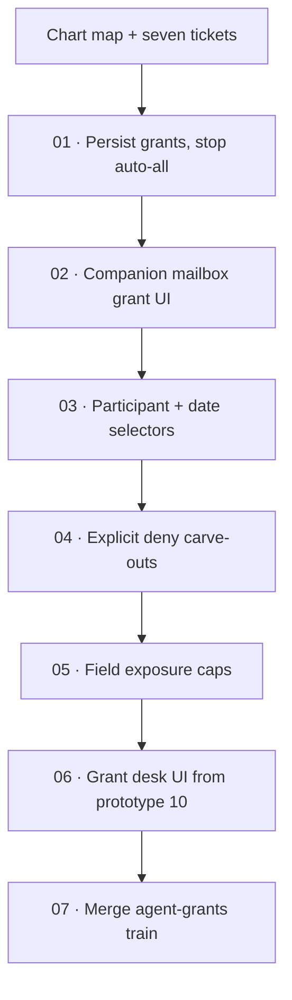

# Agent Grant Authoring

Label: wayfinder:map

## Destination

Ship usable **per-agent data access control** on top of the local-read companion: persist grants, let humans pick account/mailbox (then richer selectors), support deny carve-outs and field caps, and land a grant desk matching product prototype 10. Stop when `train/agent-grants` merges to `main`. OAuth stays a later train; local-read source stays.

**Reached.** `train/agent-grants` merged to `main` (ticket 07). Next train is OAuth.

## Notes

- Builds on shipped `GrantGate` / `AgentReadAPI` / pairing (local-read ticket 05). Auto-allow-every-account removed (ticket 01).
- Product lock: [07 · Per-Agent Authorization](../mailgent-product-definition/issues/07-define-agent-authorization.md) + [10 · Policy Authoring](../mailgent-product-definition/issues/10-prototype-policy-authoring.md) (`examples/prototype-policy-authoring.html`).
- Seams (TDD): **GrantGate** (evaluate allow/deny + selectors + fields), **AgentBridge** (persist/restore grants with pairing), companion grant UI (desk later).
- Effective access: `class ceiling ∩ allows − denies`. First ship stays `machine-local` only; no remote / lan-inference promotion yet.
- Data grants only this train. Mutation capabilities (send/trash/…) wait for OAuth-era work.
- YAGNI: no regex/wildcard/AI rules; no smart folders until ticket 03+ if still needed; no Touch ID purge; no OAuth clients.
- Git: long-lived `train/agent-grants` off `main`; topic branches PR back. Do not commit live mail, FDA bookmarks, pairing secrets, or grant files with secrets.

## Decisions so far

- [Persist Grants, Stop Auto-All](issues/01-persist-grants.md) — grants.json + list/replaceAll; no auto-all accounts
- [Companion Mailbox Grant UI](issues/02-mailbox-grant-ui.md) — control-center account/mailbox checkboxes
- [Participant and Date Selectors](issues/03-selector-grants.md) — From/To/date on Grant; Narrow fields in companion
- [Explicit Deny Carve-Outs](issues/04-deny-carveouts.md) — Grant.mode deny; deny-mode checkbox in companion
- [Field Exposure Caps](issues/05-field-exposure.md) — GrantFields; body-off get omits without stubs
- [Grant Desk UI](issues/06-grant-desk.md) — lean Scope/Access desk window (prototype 10 IA subset)
- [Merge Agent-Grants Train](issues/07-merge-train.md) — `train/agent-grants` → `main`; OAuth later

## Not yet specified

- Smart-folder reusable selectors (product has them; may fold into later polish).
- Grant expiry / timed sessions (product has them; default = until revoked).
- Policy “Test” pre-save counts in the desk.
- Field-aware FTS search when body is off.
- Full dual-pane agent list + nested grants from HTML prototype (lean desk ships first).

## Branches

| Branch | Parent | Issue | Merge target |
| --- | --- | --- | --- |
| `train/agent-grants` | `main` | — | **merged to `main`** (ticket 07) |
| `feat/01-persist-grants` | `train/agent-grants` | 01 | `train/agent-grants` |
| `feat/02-mailbox-grant-ui` | `train/agent-grants` | 02 | `train/agent-grants` |
| `feat/03-selector-grants` | `train/agent-grants` | 03 | `train/agent-grants` |
| `feat/04-deny-carveouts` | `train/agent-grants` | 04 | `train/agent-grants` |
| `feat/05-field-exposure` | `train/agent-grants` | 05 | `train/agent-grants` |
| `feat/06-grant-desk` | `train/agent-grants` | 06 | `train/agent-grants` |

## Out of scope

- Gmail/Yahoo OAuth (`train/oauth`).
- Mutation capabilities + approval queue.
- Remote / `lan-inference` trust classes.
- Writing Apple Mail’s store.

## Tickets

| # | Title | Type | Status |
|---|-------|------|--------|
| 01 | [Persist Grants, Stop Auto-All](issues/01-persist-grants.md) | task | resolved |
| 02 | [Companion Mailbox Grant UI](issues/02-mailbox-grant-ui.md) | task | resolved |
| 03 | [Participant and Date Selectors](issues/03-selector-grants.md) | task | resolved |
| 04 | [Explicit Deny Carve-Outs](issues/04-deny-carveouts.md) | task | resolved |
| 05 | [Field Exposure Caps](issues/05-field-exposure.md) | task | resolved |
| 06 | [Grant Desk UI](issues/06-grant-desk.md) | task | resolved |
| 07 | [Merge Agent-Grants Train](issues/07-merge-train.md) | task | resolved |
