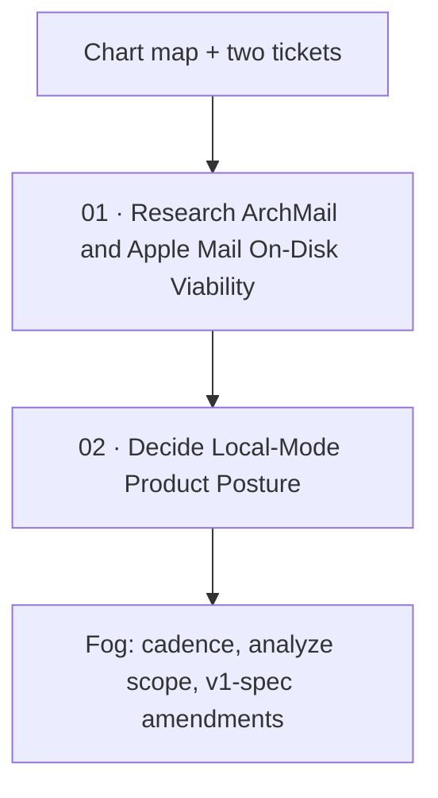

# Apple Mail Local-Mode

Label: wayfinder:map

## Destination

Decide whether MailGent should read Apple Mail's already-downloaded store (`~/Library/Mail`) as a **temporary local source**, and if so whether the proposed **poll → analyze → copy-paste** posture is the one to keep — enough to know whether to amend [Lock MailGent v1 Product](../mailgent-product-definition/map.md). Stop before architecture, code, or implementation tickets.

## Notes

- Proposed loop (seed; not locked): poll `~/Library/Mail` on a cadence → maintain local message list → on new `.emlx`, read and analyze → support read/search in MailGent; compose reply draft → user copies and pastes into Mail.app.
- ArchMail (`/Users/marotron/Dev/ArchMail`) already scrapes Apple Mail on disk. Reusable cores: `EmlxReader.swift`, `MboxReader.swift`, `MailAccountCatalog.swift`, `MimeMessageParser.swift`. Consult before re-implementing anything.
- Use `/research` for research tickets, `/grilling` + `/domain-modeling` for HITL.
- Use `/prototype` only if research leaves a behavior question paper cannot answer (e.g., whether copy-paste compose feels like enough of a send path).
- YAGNI: no Mail-store writes, no `mailto:`, no AppleScript, no MessageUI unless grilling explicitly rejects copy-paste.
- Do not amend the v1 spec until this map produces a resolved posture decision.

## Decisions so far

- [Research ArchMail and Apple Mail On-Disk Viability](issues/01-research-archmail-ondisk-viability.md) — ArchMail-style read of `~/Library/Mail` is viable with FDA or a security-scoped bookmark; FSEvents + on-open sweep; no Envelope Index; no store writes; surface partial/undownloaded mail

## Not yet specified

- Poll cadence: FSEvents vs hourly vs on-open.
- What "analyze / do something" covers when the store is read-only (agent read? local notes? reply drafts?).
- How clipboard-draft maps onto v1 approval/send flow.
- Which accounts and mailboxes are in scope.
- UX entry point: toggle vs onboarding vs standalone pre-OAuth sidecar.
- Whether this amends v1 spec directly or is a pre-OAuth-only sidecar that expires when OAuth lands.

## Out of scope

- Implementing the reader or copying ArchMail into MailGent.
- Writing Apple Mail's store.
- Provider OAuth (lives on the v1 map).
- Replacing Apple Mail.
- `mailto:` / AppleScript / scripting unless grilling rejects copy-paste.

## Tickets

| # | Title | Type | Status |
|---|-------|------|--------|
| 01 | [Research ArchMail and Apple Mail On-Disk Viability](issues/01-research-archmail-ondisk-viability.md) | research | resolved |
| 02 | [Decide Local-Mode Product Posture](issues/02-decide-local-mode-posture.md) | grilling | claimed |
