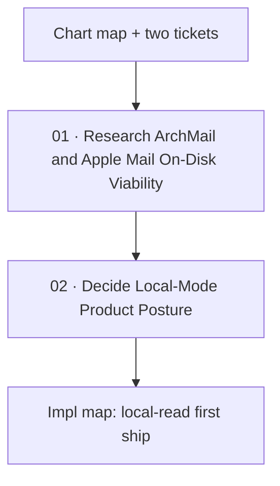

# Apple Mail Local-Mode

Label: wayfinder:map

## Destination

Decide whether MailGent should read Apple Mail's already-downloaded store (`~/Library/Mail`) as a **temporary local source**, and if so whether the proposed **poll → analyze → copy-paste** posture is the one to keep — enough to know whether to amend [Lock MailGent v1 Product](../mailgent-product-definition/map.md). Stop before architecture, code, or implementation tickets.

**Reached.** Lasting first-ship source locked; outbound deferred. Implementation continues on [Apple Mail Local-Read First Ship](../mailgent-local-read-impl/map.md).

## Notes

- Locked read loop: watch `~/Library/Mail` (FSEvents while running + on-open sweep) → maintain on-device index → expose search/read/get in MailGent and to a paired local agent. Companion posture, not a replacement client.
- ArchMail (`/Users/marotron/Dev/ArchMail`) already scrapes Apple Mail on disk. Reusable cores: `EmlxReader.swift`, `MboxReader.swift`, `MailAccountCatalog.swift`, `MimeMessageParser.swift`. Consult before re-implementing anything.
- Outbound (copy-paste vs MailGent draft ledger) is deferred until after read+MCP exists. No Mail-store writes, no `mailto:`, no AppleScript, no MessageUI unless that later prototype rejects copy-paste.
- YAGNI for this map: no architecture or implementation tickets here — those live on the impl map.

## Decisions so far

- [Research ArchMail and Apple Mail On-Disk Viability](issues/01-research-archmail-ondisk-viability.md) — ArchMail-style read of `~/Library/Mail` is viable with FDA or a security-scoped bookmark; FSEvents + on-open sweep; no Envelope Index; no store writes; surface partial/undownloaded mail
- [Decide Local-Mode Product Posture](issues/02-decide-local-mode-posture.md) — lasting first-ship source, not a throwaway sidecar; OAuth is the next train; local-read stays; outbound deferred (no send path named for local-read yet)

## Not yet specified

- Copy-paste vs MailGent-owned draft ledger (after read+MCP; see impl Stage 6).
- Which accounts and mailboxes are in first-ship scope (impl).
- Companion read IA among the three layouts (impl Stage 4).

## Out of scope

- Implementing the reader or copying ArchMail into MailGent (impl map).
- Writing Apple Mail's store.
- Provider OAuth (later train).
- Replacing Apple Mail.
- `mailto:` / AppleScript / scripting unless the later draft prototype rejects copy-paste.

## Tickets

| # | Title | Type | Status |
|---|-------|------|--------|
| 01 | [Research ArchMail and Apple Mail On-Disk Viability](issues/01-research-archmail-ondisk-viability.md) | research | resolved |
| 02 | [Decide Local-Mode Product Posture](issues/02-decide-local-mode-posture.md) | grilling | resolved |
