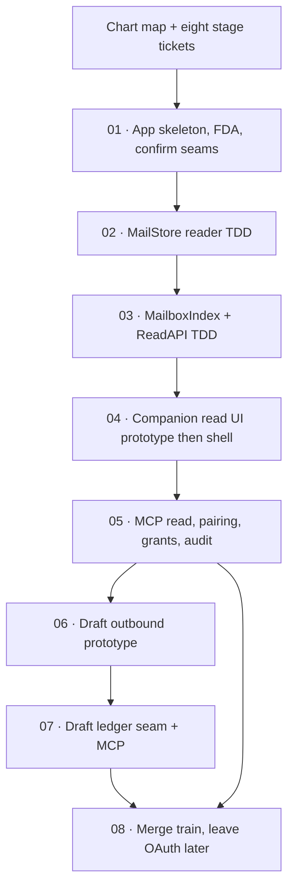

# Apple Mail Local-Read First Ship

Label: wayfinder:map

## Destination

Ship MailGent’s first usable product: a lightweight macOS companion that reads Apple Mail’s already-downloaded store, indexes it on-device, and exposes scoped read/search/get to a paired local agent over MCP. **Shipped:** `train/local-read` merged to `main` (ticket 08). OAuth is a later train; local-read stays.

## Notes

- Source: `~/Library/Mail` `.emlx` / `.partial.emlx` only. Surface partial and undownloaded mail; never treat as full. No Envelope Index. No store writes.
- Incremental: FSEvents while running + on-open sweep keyed by path/mtime/inode. No always-on daemon.
- Agent: MailGent is the MCP **server**; first ship is hardened loopback HTTP, one paired `machine-local` agent, account + mailbox allows, read ops + draft ledger create/update, append-only audit.
- Distribution working assumption: Developer ID + notarization + Full Disk Access (or security-scoped bookmark). MAS sandbox is hostile.
- Reuse ArchMail cores (`EmlxReader`, `MailAccountCatalog`, `MimeMessageParser`, tests/fixtures) into a MailGent `MailStore` target. Do not submodule ArchMail.
- TDD seams (confirmed on ticket 01; extended on 07): MailStore, MailboxIndex, ReadAPI, GrantGate, Pairing, AuditLog, DraftLedger.
- One command: `make test` (`xcodegen generate` + `xcodebuild test`).
- Git: long-lived `train/local-read`; topic branches fork from it and PR back. Do not commit live mail, FDA bookmarks, or pairing secrets.
- YAGNI: no OAuth, no helper daemon, no Mail writes, no Spotlight donation of bodies, no iOS, no built-in assistant. Draft ledger is in-scope after ticket 06 picked B.

## Decisions so far

- [Research ArchMail and Apple Mail On-Disk Viability](../mailgent-local-mode/issues/01-research-archmail-ondisk-viability.md) — read path viable; FDA or bookmark; FSEvents + on-open; no Envelope Index; no writes
- [Decide Local-Mode Product Posture](../mailgent-local-mode/issues/02-decide-local-mode-posture.md) — lasting first-ship source; OAuth next train; outbound deferred
- [App Skeleton, FDA Onboarding, Confirm TDD Seams](issues/01-app-skeleton-fda-seams.md) — SwiftUI app + MailStore; FDA fail-closed; six seams confirmed; `make test`
- [MailStore Reader TDD](issues/02-mail-store-reader.md) — fixture `V*` catalog; `.emlx` headers/body; partial + draft `0x10`; attachment metadata + on-demand bytes
- [MailboxIndex and ReadAPI TDD](issues/03-mailbox-index-read-api.md) — SQLite FTS ingest; identity skip; search/get/list pages; partial marked; empty body `not_available`
- [Companion Read UI Prototype Then Shell](issues/04-companion-read-ui.md) — control-first; menu-bar popover launches detached window; proto on `proto/companion-read-ui`
- [MCP Read, Pairing, Grants, Audit](issues/05-mcp-pairing-grants-audit.md) — loopback MCP `127.0.0.1:8787`; Pairing/GrantGate/AuditLog; Cursor list/search/get E2E
- [Draft Outbound Prototype](issues/06-draft-outbound.md) — **B wins** (versioned draft ledger); proto on `proto/draft-outbound`; feat on `feat/07-draft-ledger`
- [Draft Ledger Seam + MCP](issues/07-draft-ledger.md) — in-memory DraftLedger; MCP `create_draft` / `update_draft`; audit; no Mail writes
- [Merge Local-Read Train](issues/08-merge-train.md) — `train/local-read` → `main`; prototypes off main; OAuth later

## Not yet specified

- Rich draft formatting (bold/italic/lists) after ledger lands.
- DraftLedger persistence across relaunch (in-memory first).
- Companion UI for ledger (prototype only for now; agent path is MCP).
- `train/oauth` chart (Gmail/Yahoo; keep local-read as a source).
- Agent grant authoring — **shipped** on `main` via [Agent Grant Authoring](../mailgent-agent-grants/map.md) (ticket 07).

## Branches

| Branch | Parent | Issue | Merge target |
| --- | --- | --- | --- |
| `train/local-read` | `research/archmail-ondisk` | — | **merged to `main`** (ticket 08) |
| `feat/01-app-skeleton` | `train/local-read` | 01 | `train/local-read` |
| `feat/02-mail-store` | `train/local-read` | 02 | `train/local-read` |
| `feat/03-mailbox-index` | `train/local-read` | 03 | `train/local-read` |
| `proto/companion-read-ui` | `feat/03-mailbox-index` | 04 | throwaway (pointer on issue; not `main`) |
| `feat/04-companion-shell` | `feat/03-mailbox-index` | 04 | `train/local-read` |
| `feat/05-mcp-read` | `feat/04-companion-shell` | 05 | `train/local-read` |
| `proto/draft-outbound` | `feat/05-mcp-read` | 06 | throwaway @ `52cb9e0` (not `main`) |
| `feat/07-draft-ledger` | `feat/05-mcp-read` | 07 | `train/local-read` |

## Out of scope

- Gmail/Yahoo OAuth (later `train/oauth`).
- Writing Apple Mail’s store; AppleScript; `mailto:`; MessageUI.
- Remote agents, mutation approvals, send/trash/delete, smart folders, private scopes, `lan-inference`.
- Mac App Store distribution on this train.
- Submoduling ArchMail.

## Tickets

| # | Title | Type | Status |
|---|-------|------|--------|
| 01 | [App Skeleton, FDA Onboarding, Confirm TDD Seams](issues/01-app-skeleton-fda-seams.md) | task | resolved |
| 02 | [MailStore Reader TDD](issues/02-mail-store-reader.md) | task | resolved |
| 03 | [MailboxIndex and ReadAPI TDD](issues/03-mailbox-index-read-api.md) | task | resolved |
| 04 | [Companion Read UI Prototype Then Shell](issues/04-companion-read-ui.md) | prototype | resolved |
| 05 | [MCP Read, Pairing, Grants, Audit](issues/05-mcp-pairing-grants-audit.md) | task | resolved |
| 06 | [Draft Outbound Prototype](issues/06-draft-outbound.md) | prototype | resolved |
| 07 | [Draft Ledger Seam + MCP](issues/07-draft-ledger.md) | task | resolved |
| 08 | [Merge Local-Read Train](issues/08-merge-train.md) | task | resolved |
