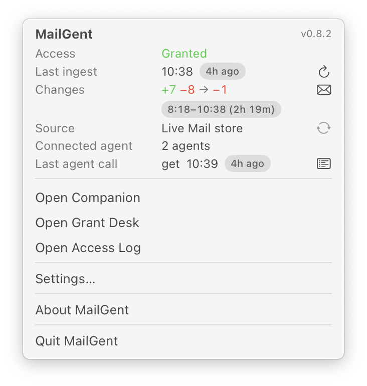
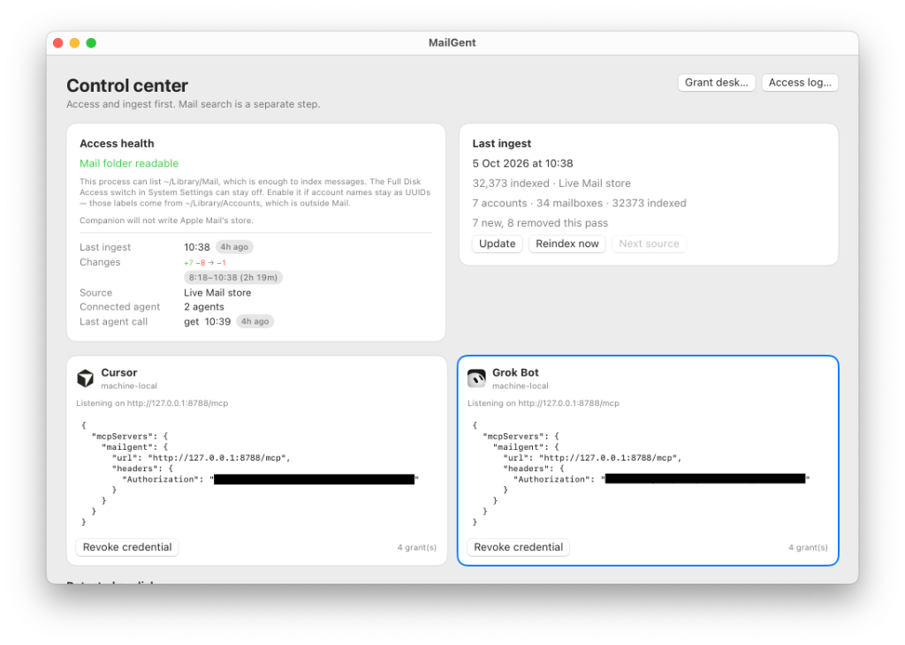
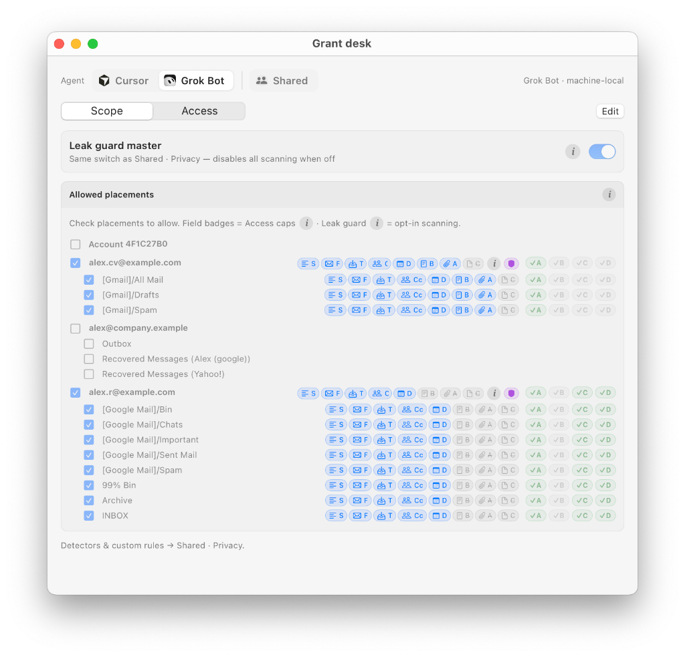
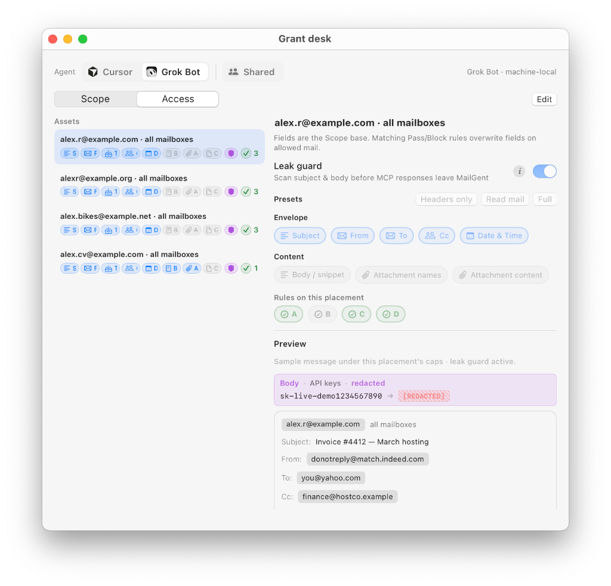
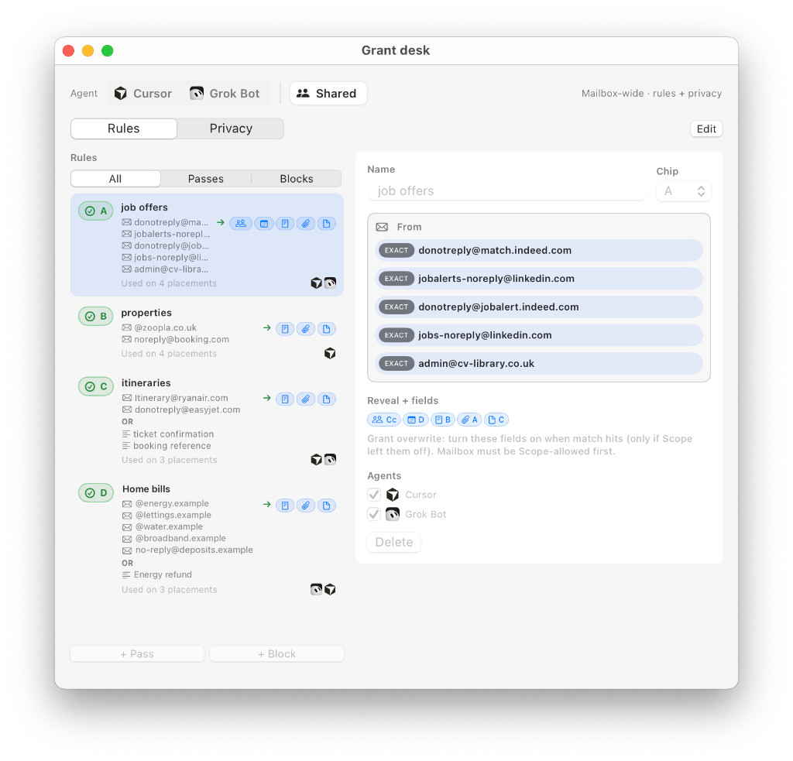
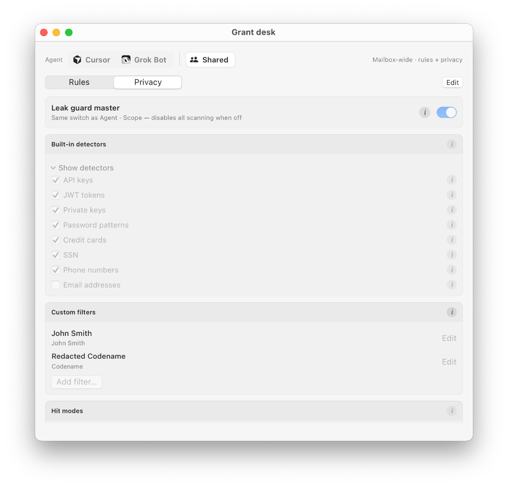
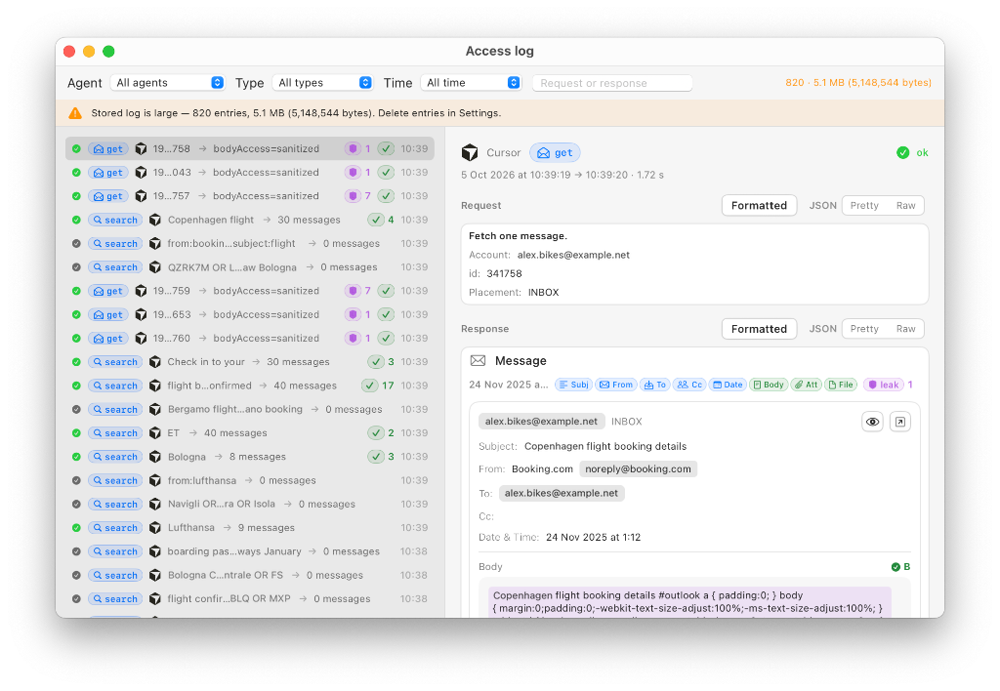
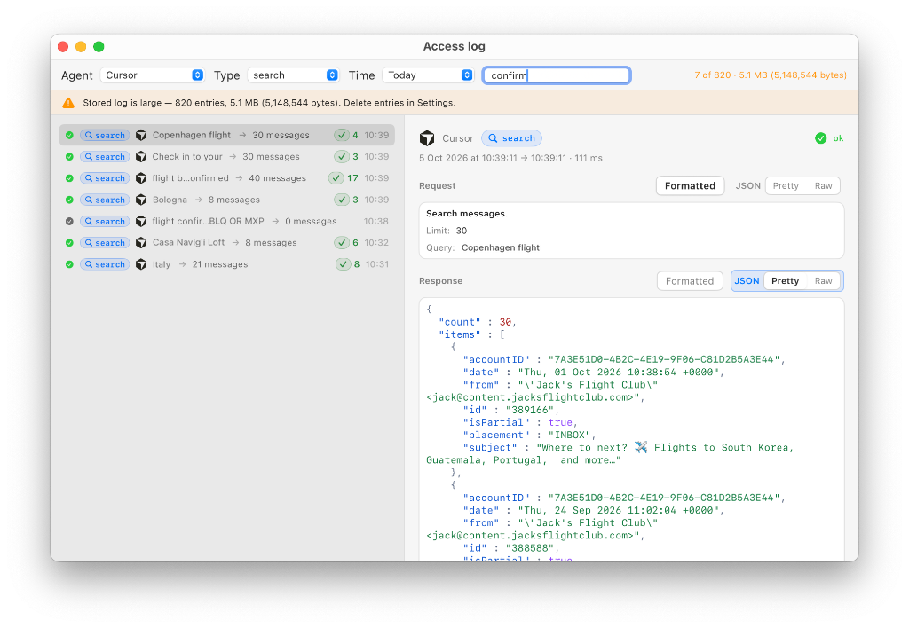

# MailGent

**0.10.1 alpha** — macOS menu-bar companion beside Apple Mail. Not a daily client. No built-in AI. External agents talk to MailGent over MCP.

This is an **alpha**, not a beta. The first-ship slice is real (Apple Mail local-read, loopback MCP, grants, audit, in-memory draft ledger). Locked v1 still needs Gmail/Yahoo OAuth, mutation approvals, send/trash/hard-delete, remote agents, smart folders, and distribution.

**Interactive demo:** [demo.html](https://marotron.github.io/MailGent/demo.html) — watch one agent request walk through Scope → Fields → Rules → Leak guard.

## Screenshots

<table>
  <tr>
    <td width="50%"><br><b>Menu bar</b> — access, last ingest, connected agents, last agent call.</td>
    <td width="50%"><br><b>Control center</b> — access health, ingest stats, one card per paired agent.</td>
  </tr>
  <tr>
    <td><br><b>Grant Desk · Scope</b> — allowed placements per agent, field caps, leak guard.</td>
    <td><br><b>Grant Desk · Access</b> — per-placement fields, presets, preview with leak guard applied.</td>
  </tr>
  <tr>
    <td><br><b>Shared · Rules</b> — Pass / Block overlays by From and Subject.</td>
    <td><br><b>Shared · Privacy</b> — built-in detectors, custom filters, hit modes.</td>
  </tr>
  <tr>
    <td><br><b>Access Log</b> — every agent call, with leak-guard and rule hit counts.</td>
    <td><br><b>Access Log · JSON</b> — the exact response the agent received.</td>
  </tr>
</table>

More in [`docs/screenshots/`](docs/screenshots/). Personal data in the screenshots (addresses, account IDs, search terms) is replaced with sample values.

## This release

- Apple Mail `.emlx` local-read from `~/Library/Mail`
- On-device SQLite FTS
- Incremental ingest reports arrivals vs removals (`+44 −2277 → −2233`); Trash/Junk copies are not counted as new
- Menu status times sit in chips; Changes shows the ingest window as `12:15–12:31 (16m)` (yesterday or the date when that window is not today); Last agent call uses clock + elapsed like Last ingest
- Multiple `machine-local` agents (Cursor, Grok Bot), each with its own Bearer, on loopback `http://127.0.0.1:8788/mcp` (8787 reserved for Cursor OAuth callbacks)
- Grant desk: account/mailbox, From/To/date, deny carve-outs, field caps including Cc/body/attachments
- Rules: Pass / Block field overlays on already-allowed mail (From/Subject match, optional When date window)
- Outbound leak guard: on-device subject/body scan before agents receive mail (opt in per placement; built-in + custom rules)
- `get_attachment`: attachment bytes as a local temp file when the grant allows Attachment Content (25 MiB cap)
- Access log of every agent call, showing exactly what the agent received (sanitized/withheld field overlays). Agents cannot edit it; you can delete entries in Settings
- Open in Apple Mail from Companion Read and Access Log previews (`message://` Message-ID handoff)
- MailGent-owned draft ledger (in-memory; not written into Mail.app; no companion draft UI yet — drafts show in the Access Log)

**Debug builds** default to fixture mail (and can switch to live Mail). **Release / production** builds use **live Mail only** — fixture is not offered and never planted. Live Mail needs a readable `~/Library/Mail` (Full Disk Access, or Choose Mail Folder…).

## Not working yet

Do not advertise these as shipped:

- Gmail/Yahoo OAuth
- Send / move / trash
- Approval queue
- Keychain pairing
- Persisted drafts

## Requirements

- macOS 14+
- Xcode 16 / Swift 6
- [XcodeGen](https://github.com/yonaskolb/XcodeGen)
- Apple Mail with mail already downloaded
- Access to `~/Library/Mail` (sandbox is off; [`MailGent.entitlements`](MailGent/MailGent.entitlements) is empty). Full Disk Access is one way; Choose Mail Folder… is enough for messages. Enable FDA if account names stay as UUIDs (`~/Library/Accounts`).

## Install / run

```bash
brew install xcodegen
make test
make run
make xcode
```

Menu bar only (`LSUIElement`). Settings → Access → Recheck, Open Full Disk Access, or Choose Mail Folder…

## Release (DMG)

Build a Release `.dmg` locally (output: `dist/MailGent-<version>.dmg`, version from `project.yml`):

```bash
make dmg        # package only
make release    # run tests, then package
```

For Gatekeeper-safe distribution, set before `make dmg`:

```bash
export MAILGENT_SIGN_IDENTITY='Developer ID Application: …'
export MAILGENT_NOTARY_PROFILE='mailgent-notary'   # `xcrun notarytool store-credentials`
```

**GitHub Release:** push tag `vX.Y.Z` matching `MARKETING_VERSION` (e.g. `v0.1.8` for `0.1.8`). The [Release workflow](.github/workflows/release.yml) builds the DMG, publishes a **pre-release** titled **`X.Y.Z alpha`**, and attaches the disk image. Notes start with that version’s section from `CHANGELOG.md`, then the install text in [`.github/RELEASE_BODY.md`](.github/RELEASE_BODY.md). Optional repo secrets: `MAILGENT_SIGN_IDENTITY`, `MAILGENT_NOTARY_PROFILE`.

```bash
git tag v0.1.8
git push origin v0.1.8
```

**Gatekeeper:** without Developer ID signing and notarization, macOS may warn or block the app on first open on other machines. Use **Open Anyway** in Privacy & Security, or right-click → **Open**. GitHub Release pages include this warning in the release notes (see [`.github/RELEASE_BODY.md`](.github/RELEASE_BODY.md)).

`make prototype-accounts` is a **dev CLI**, not part of the `.app`.

## Pair agents

In the companion, **Pair Cursor** and/or **Pair Grok Bot**. Same loopback URL; each agent gets its own Bearer. Grok Bot shows a copyable MCP snippet for the host to wire itself. Grants are independent per agent in Grant Desk.

On first launch with no saved pairing, MailGent pairs **Cursor** automatically. If `~/.cursor/mcp.json` exists, MailGent writes (and on revoke removes) a `mailgent` entry with the loopback URL and Cursor's Bearer. A new agent has no grants, so it sees no mail until you allow mailboxes in Grant Desk.

Tools: `search`, `list`, `list_new`, `list_placements`, `get`, `get_attachment`, `open_in_mail`, `create_draft`, `update_draft`, `status`, `update`, `set_source` (`open_in_mail` and source switch are off unless Settings allows them).

## License

SPDX `Apache-2.0`. See [`LICENSE`](LICENSE) and [`NOTICE`](NOTICE).

The names “MailGent” and the MailGent logos are trademarks of the copyright holder. Apache-2.0 does not grant trademark rights. Forks must rename.

Official binaries (when they exist) are notarized GitHub Releases. A Homebrew cask is **planned later** from that same file — not this alpha. No placeholder sha256.

## Warranty

Software is provided **AS IS**, without warranty of any kind, including fitness for a particular purpose. Mail may be lost or shown incompletely (partial `.emlx` files). This alpha does not mutate Apple Mail’s on-disk store. Time Machine or your provider’s Trash is your backstop, not a restore promise. Paired agents have their own practices — see [`PRIVACY.md`](PRIVACY.md). This license does not override consumer law where that law applies.

## Privacy

Device-first. See [`PRIVACY.md`](PRIVACY.md). Runtime data lives under `~/Library/Application Support/MailGent/`. Revoke pairing anytime.

## Roadmap

From the locked v1 spec and first-ship maps, not new invention:

- **Next train:** Gmail + Yahoo OAuth (keep local-read as a source). Yahoo commercial OAuth is still pending.
- Mutation approval queue (send, move, label, archive, flags)
- Soft delete → Trash (agent-proposeable + human). Hard/permanent delete per spec (stronger confirm; agent exposure as locked in ticket 08)
- Persistent draft ledger + companion draft UI; still no Apple Mail store writes on local-read
- Pairing polish, grant expiry, smart-folder selectors, Touch ID audit purge
- Menu bar icon polish (current SF Symbol status item; final mark and pulse animation TBD)
- Personal Apple Developer Program → Developer ID + notarized GitHub Release (Gatekeeper-friendly binary outside the App Store; ticket 16 still open). Mac App Store is hostile to `~/Library/Mail`
- In-app updates via Sparkle (check GitHub Releases, notify, user chooses to install)
- Homebrew cask of the same notarized Release artifact (custom tap first; `homebrew/cask` later)
- Later: remote/expiring sessions, `lan-inference`, iPhone/iPad, Microsoft/Proton

**Out of scope for v1:** built-in assistant, unattended remote inbox, replacing Apple Mail
